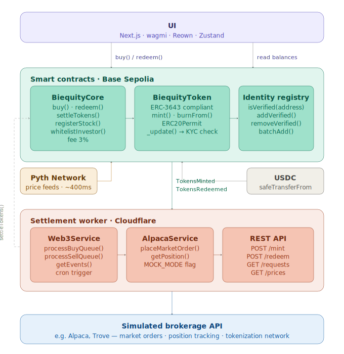
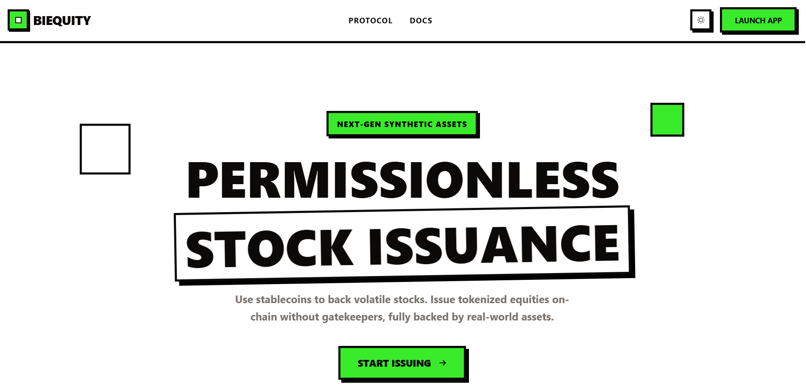
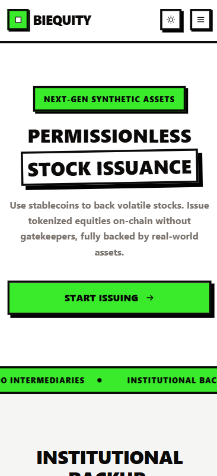
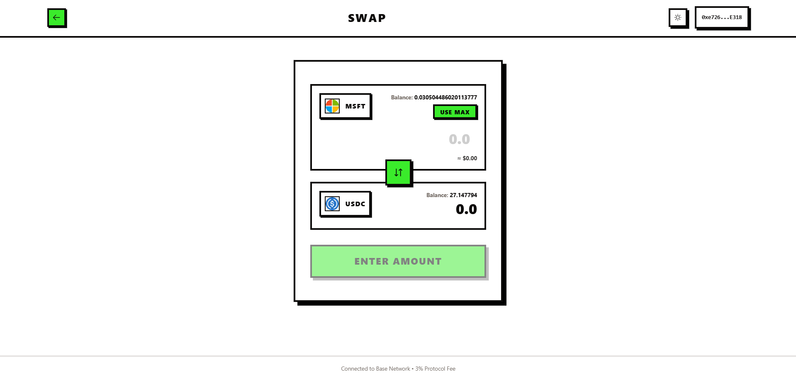
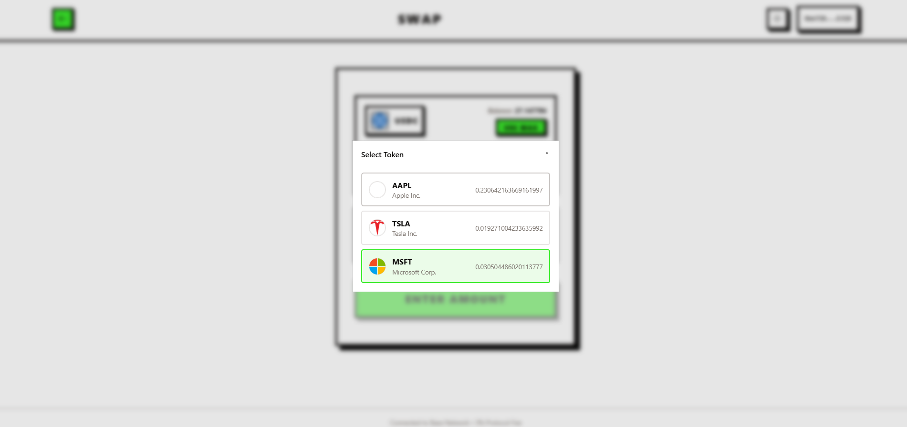
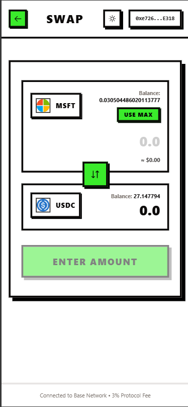
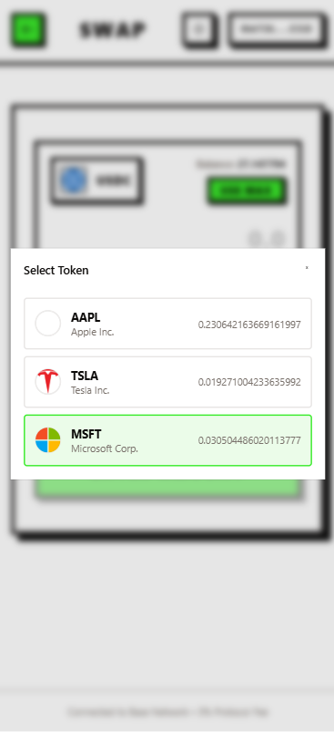

<div align="center">
  

  <h1>BIEQUITY</h1>

  <p><strong>Permissionless tokenized stock issuance on Base.</strong><br/>
  Deposit USDC. Receive on-chain stock tokens backed 1:1 by real shares held in custody.</p>

  <p>
    <a href="https://www.biequity.xyz"><strong>🌐 Live App</strong></a> &nbsp;·&nbsp;
    <a href="#-quick-start">🚀 Run Locally</a> &nbsp;·&nbsp;
    <a href="#-architecture">🏗 Architecture</a> &nbsp;·&nbsp;
    <a href="#-design-decisions">🧠 Design Decisions</a>
  </p>

  <p>
    
    
    
    
    
  </p>
</div>

---

Biequity lets anyone swap USDC for tokenized US equities — `bieAAPL`, `bieTSLA`, `bieMSFT` — directly from a wallet, no broker account required. Each token is minted on-chain and backed 1:1 by a real share purchased and held by a brokerage partner. Tokens are ERC-3643 compliant, meaning transfers are gated by an on-chain identity registry — only KYC-verified addresses can hold or move them.

---

## 📹 Demo

> Watch the full walkthrough — deposit USDC, select a stock, approve, mint, and see the token land in your wallet.

<video src="apps/web/public/images/biequity-demo.mov" controls="controls" width="100%"></video>

---

## 🏗 Architecture

The system is a Turborepo monorepo with three primary layers: smart contracts on Base Sepolia, a Next.js 14 frontend, and a Cloudflare Worker that bridges on-chain events to a traditional brokerage API.



### How the full flow works

```
User deposits USDC
        │
        ▼
BiequityCore.buy("AAPL", amount)
  ├── Pyth oracle → get current AAPL/USD price
  ├── Calculate token qty (netUSDC / price)
  ├── Collect 3% fee → treasury
  ├── BiequityTokenFactory.deployedTokens["AAPL"] → mint bieAAPL to user
  └── Emit TokensMinted(symbol, amount, netUsdc)
        │
        ▼ (async — Cloudflare Worker cron)
Web3Service.processBuyQueue()
  ├── Read TokensMinted events (last 100 blocks)
  ├── AlpacaService.placeMarketOrder("AAPL", qty, "buy")
  └── BiequityCore.settleTokens("AAPL", amount)  ← confirms 1:1 backing
        │
        ▼
bieAAPL tokens are now fully backed and redeemable
```

### Contract map

| Contract | Role |
|---|---|
| `BiequityCore` | Protocol entry point — `buy()`, `redeem()`, `settleTokens()`, fee collection, treasury |
| `BiequityTokenFactory` | Deploys one `BiequityToken` per registered stock symbol |
| `BiequityToken` | ERC-3643 compliant ERC-20 — transfer gating, `ERC20Permit`, `ERC20Pausable` |
| `IdentityRegistry` | On-chain KYC whitelist — `isVerified(address)` called on every transfer |

**Deployed on Base Sepolia:** `BiequityCore` at `0x8B0EF8eD5D6F3ceF0803c26Ea7471ba83CB6cB80`

**Pyth price feeds used:**

| Stock | Feed ID |
|---|---|
| AAPL | `0x49f6b65cb1de6b10eaf75e7c03ca029c306d0357e91b5311b175084a5ad55688` |
| TSLA | `0x16dad506d7db8da01c87581c87ca897a012a153557d4d578c3b9c9e1bc0632f1` |
| MSFT | `0xd0ca23c1cc005e004ccf1db5bf76aeb6a49218f43dac3d4b275e92de12ded4d1` |

---

## 📸 Screenshots

<table>
  <tr>
    <td></td>
    <td></td>
  </tr>
  <tr>
    <td colspan="2"><em>Landing page — neobrutalist design with animated minting engine</em></td>
  </tr>
</table>

<table>
  <tr>
    <td></td>
    <td></td>
  </tr>
  <tr>
    <td><em>Swap interface — USDC in, stock token out. Connected wallet shows live balances.</em></td>
    <td><em>Token selector — shows AAPL, TSLA, MSFT with real on-chain balances pulled from the contract.</em></td>
  </tr>
</table>

<table>
  <tr>
    <td></td>
    <td></td>
  </tr>
  <tr>
    <td colspan="2"><em>Fully responsive — same swap experience on mobile with touch-optimised token selector.</em></td>
  </tr>
</table>

---

## 📁 Folder Structure

```
biequity/
├── apps/
│   ├── web/                          # Next.js 14 frontend (PWA, dark mode)
│   │   ├── app/
│   │   │   ├── (marketing)/          # Landing page + protocol explainer
│   │   │   └── (apps)/trade/         # Swap UI
│   │   ├── components/
│   │   │   ├── trade/                # trade-ui · trade-transaction-dialog
│   │   │   │                         # token-selector-dialog · numerical-input
│   │   │   └── protocol/             # Protocol info + compliance explainer
│   │   ├── hooks/                    # useTradeContract · useStockPrices
│   │   │                             # useUSDCApproval · useBalances
│   │   ├── store/                    # Zustand — trade · prices · balances
│   │   ├── config/                   # Contract ABIs · wagmi config · web3 setup
│   │   └── providers/                # Reown/wagmi · theme · data providers
│   │
│   └── cloudfare-worker/             # Cloudflare Worker (Hono framework)
│       ├── src/
│       │   ├── controllers/          # assets.controller · webhook.controller
│       │   ├── services/             # alpaca.service · web3.service
│       │   ├── web3/                 # viem client · contract helpers · ABI
│       │   └── routes/               # Hono route definitions
│       └── wrangler.jsonc
│
├── contracts/                        # Foundry project
│   ├── src/
│   │   ├── BiequityCore.sol          # Protocol core (buy · redeem · settle)
│   │   ├── BiequityToken.sol         # ERC-3643 stock token
│   │   ├── BiequityTokenFactory.sol  # Token deployer (one per stock)
│   │   ├── IdentityRegistry.sol      # KYC whitelist
│   │   └── interfaces/
│   │       └── IIdentityRegistry.sol
│   ├── script/
│   │   ├── Deploy.s.sol              # Deploy BiequityCore
│   │   └── SetupStocks.s.sol         # Register AAPL/TSLA/MSFT
│   └── test/
│
└── packages/
    ├── assets/                       # Shared token defs + Pyth feed IDs
    ├── ui/                           # Shared shadcn/ui components
    ├── eslint-config/
    └── typescript-config/
```

---

## 🚀 Quick Start

### With Docker (easiest)

```bash
git clone https://github.com/IbrahimIjai/biequity
cd biequity
cp .env.example .env.local   # fill in NEXT_PUBLIC_PROJECT_ID
docker compose up
```

- Web app: [http://localhost:3000](http://localhost:3000)
- Worker API: [http://localhost:8787](http://localhost:8787)

The worker runs in `MOCK_MODE=true` by default — no real brokerage credentials needed. Everything simulates successfully.

### Manual setup

```bash
# Install (uses Bun workspaces)
bun install

# Terminal 1 — web app
cd apps/web
bun dev

# Terminal 2 — cloudflare worker
cd apps/cloudfare-worker
wrangler dev

# Terminal 3 — contract tests
cd contracts
forge test -vv
```

### Environment variables

**`apps/web/.env.local`**
```bash
NEXT_PUBLIC_PROJECT_ID=    # Reown project ID — get from cloud.reown.com
NEXT_PUBLIC_WORKER_URL=http://localhost:8787
```

**`apps/cloudfare-worker/wrangler.jsonc`** (or Cloudflare secrets for prod)
```jsonc
{
  "vars": {
    "MOCK_MODE": "true",               // set "false" for live Alpaca
    "ALPACA_API_KEY": "",              // production only
    "ALPACA_SECRET_KEY": "",           // production only
    "OPERATOR_PRIVATE_KEY": "",        // wallet that calls settleTokens()
    "RPC_URL": "",                     // Base Sepolia RPC URL
    "BIEQUITY_CORE_ADDRESS": "0x8B0EF8eD5D6F3ceF0803c26Ea7471ba83CB6cB80"
  }
}
```

### Deploy contracts

```bash
cd contracts

# Deploy core
forge script script/Deploy.s.sol \
  --rpc-url base-sepolia \
  --broadcast \
  --verify

# Register stocks
forge script script/SetupStocks.s.sol \
  --rpc-url base-sepolia \
  --broadcast
```

---

## 🧠 Design Decisions

### Why ERC-3643 instead of a plain ERC-20?

Tokenized equities are regulated instruments, not commodities. A vanilla ERC-20 allows any address to receive or move the token — which conflicts with securities regulations in essentially every jurisdiction that has addressed the question.

ERC-3643 (the T-REX standard, used by Backed/xStocks and Ondo in production) embeds the compliance check inside the token's own transfer function. The `_update()` override queries an `IdentityRegistry` before every peer-to-peer transfer and reverts with a typed error if either party isn't verified. This makes compliance protocol-level rather than app-level — you can't route around it through a different UI.

```solidity
// BiequityToken._update() — called on every transfer
if (!isMint && !isBurn) {
    if (!identityRegistry.isVerified(from)) revert TransferNotCompliant(from, to);
    if (!identityRegistry.isVerified(to))   revert TransferNotCompliant(from, to);
}
```

The trade-off is DeFi composability: compliant tokens don't drop into Uniswap or Aave. The production approach for that is a whitelisted ERC-20 wrapper — the underlying position stays compliant, a separate wrapper is whitelisted for specific DeFi pools. That's out of scope here but a clear next step.

### Why Cloudflare Workers instead of a traditional backend?

The settlement layer needs to do exactly one thing reliably: wake up periodically, read recent on-chain events, place a brokerage order, and write back to the chain. That's a stateless, I/O-bound workload that runs for a few hundred milliseconds at most.

A traditional Node server would require provisioning, a process manager, uptime monitoring, and scaling logic — all overhead for something a Cloudflare Worker handles natively with a built-in cron trigger and zero infrastructure. At scale, you'd want more durable execution guarantees (Cloudflare Durable Objects, or a proper queue-backed worker), but for a protocol at this stage Workers are the right abstraction.

### Why Pyth Network over Chainlink?

Two concrete reasons: update latency and equity coverage.

Pyth uses a pull-based oracle model — publishers push prices to Pyth's off-chain network continuously (~400ms cadence), and contracts pull the latest price in at the moment they need it. Chainlink's push-based model updates on a deviation threshold or heartbeat, often 1–3 minutes for equity feeds. For a protocol where the price directly determines how many tokens a user receives per dollar of USDC, a 2-minute stale price during a volatile period is meaningful slippage.

Pyth also has broader US equity feed coverage in its current catalogue. The `getPriceUnsafe()` call used here doesn't revert on stale data — in production you'd use `getPrice(feedId, maxAge)` to enforce a freshness bound.

---

## 🔌 Simulated Providers

In production, the settlement layer would integrate with [**Alpaca's Instant Tokenization Network (ITN)**](https://alpaca.markets/tokenization) — a real infrastructure layer for minting and redeeming tokenized securities.

The ITN works as follows: an authorized participant (AP) calls `POST /v2/tokenization/mint` with a stock symbol, quantity, and destination wallet. Alpaca journals the underlying shares from the AP's brokerage account to the issuer's account (currently xStocks, recently acquired by Kraken). The issuer deposits the tokenized asset to the AP's wallet. Redemption is the reverse. Alpaca currently commands an estimated 94% global market share in tokenized US equities infrastructure.

Becoming an authorized participant requires a formal onboarding relationship with Alpaca — it's not available to individual developers, and Alpaca's ITN currently only supports Solana as its settlement chain.

For these reasons, the worker runs in `MOCK_MODE=true` by default. `MockProviderService` intercepts all brokerage and tokenization calls and returns realistic responses with simulated latency, auto-settling requests after 2 seconds. The code path is architecturally identical to the production path — switching to live mode is a configuration change (`MOCK_MODE=false` + real Alpaca credentials), not a code change.

---

## ⚠️ Status

Biequity is an **experimental research project** deployed on Base Sepolia testnet. It does not handle real money and is not production-ready.

There's a plausible path to mainnet, pending a few open questions:

- **Regulatory clarity** — operating a tokenized securities platform typically requires a broker-dealer license or a formal partnership with one. Alpaca provides the brokerage infrastructure; what's needed is clarity on jurisdiction, issuer relationship, and what "authorized participant" status requires in practice.
- **EVM support on Alpaca ITN** — the ITN currently only settles on Solana. Base (EVM) support is on their roadmap.
- **DeFi wrapper** — the ERC-3643 compliance layer blocks standard DeFi integrations. A whitelisted ERC-20 wrapper would unlock lending and yield strategies on top of the positions.

If this is in the direction you're building — tokenized RWA infrastructure, Africa-focused DeFi access to US markets, or something adjacent — open an issue or reach out.

---

## License

MIT

<div align="center">
  <sub>Built with Foundry · Next.js 14 · Cloudflare Workers · Pyth Network · wagmi · Base</sub>
</div>
