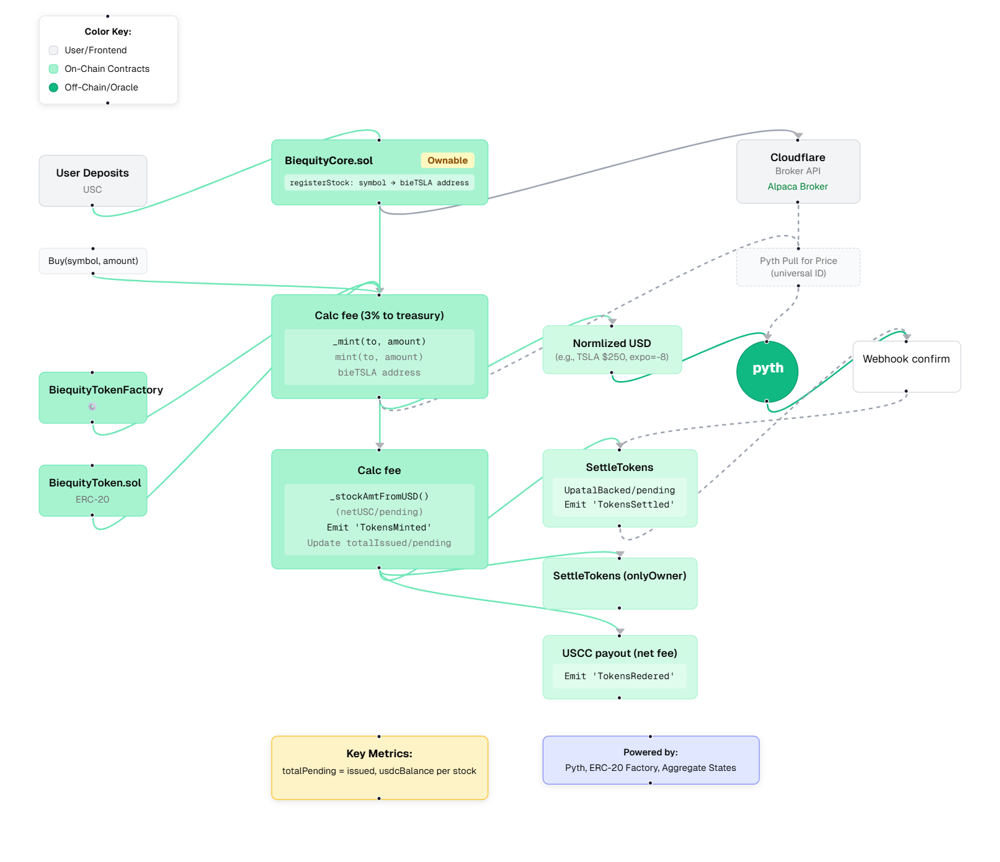

<div align="center">

# 🏛️ Biequity

**Decentralized Tokenized Stock Trading Platform**

_Issue, trade, and redeem fully-backed tokenized equities with transparent onchain collateral_

[](https://base.org)
[](https://nextjs.org)
[](https://wagmi.sh)
[](https://typescriptlang.org)
[](LICENSE)

[🚀 Live Demo](https://biequity.xyz) · [📖 Documentation](https://docs.biequity.xyz) · [🐛 Report Bug](https://github.com/IbrahimIjai/biequity/issues) · [💡 Request Feature](https://github.com/IbrahimIjai/biequity/issues)

</div>

---

## 🌟 Overview

**Biequity** is a revolutionary DeFi protocol that bridges traditional stock markets with blockchain technology. Built on Base, it enables users to mint, trade, and redeem tokenized equities backed by transparent onchain collateral using stablecoins.

### ✨ Key Features

🔒 **Fully Collateralized** - Every stock token is backed 1:1 with USDC collateral  
📈 **Real-time Pricing** - Integrated with Pyth Network oracles for live market data  
🎯 **Transparent Trading** - All transactions and collateral visible onchain  
🔄 **Instant Settlement** - Mint and redeem tokens instantly with smart contracts  
🌐 **Cross-platform** - Web app + Farcaster Mini App integration  
⚡ **Built on Base** - Fast, cheap transactions with Ethereum security

### 🎯 Use Cases

- **Retail Investors** - Access fractional stock ownership with crypto
- **DeFi Traders** - Trade tokenized equities in DeFi protocols
- **Portfolio Managers** - Create diversified stock/crypto portfolios
- **International Users** - Access US stocks without traditional barriers

## 🏗️ Architecture



### 📋 System Components

| Component                 | Description                                               | Technology           |
| ------------------------- | --------------------------------------------------------- | -------------------- |
| **Smart Contracts**       | Core protocol logic, token minting, collateral management | Solidity ^0.8.13     |
| **Price Oracles**         | Real-time stock price feeds                               | Pyth Network         |
| **Frontend DApp**         | User interface for trading and portfolio management       | Next.js 15, React 19 |
| **Farcaster Integration** | Mini app for social trading                               | MiniKit SDK          |
| **Wallet Connection**     | Multi-wallet support and transaction signing              | Reown AppKit, wagmi  |

### 🔧 Tech Stack

#### **Blockchain & Smart Contracts**

- **Solidity** `^0.8.13` - Smart contract development
- **Foundry** - Development framework and testing
- **OpenZeppelin** - Security-audited contract libraries
- **Base Network** - L2 scaling solution
- **Pyth Network** - Decentralized price oracles

#### **Frontend & User Interface**

- **Next.js** `15` - React framework with App Router
- **React** `19` - Modern UI library with concurrent features
- **TypeScript** `5.0` - Type-safe development
- **Tailwind CSS** `4` - Utility-first styling
- **Radix UI** - Accessible component primitives

#### **Web3 Integration**

- **wagmi** `2.0` - React hooks for Ethereum
- **viem** `2.0` - TypeScript interface for Ethereum
- **Reown AppKit** - WalletConnect v2 integration
- **@tanstack/react-query** `5` - Server state management

#### **Developer Experience**

- **Biome** - Fast formatter and linter
- **Renovate** - Dependency updates automation
- **pnpm** - Efficient package manager

## 🚀 Quick Start

### Prerequisites

- **Node.js** >= 18.0.0
- **pnpm** >= 8.0.0 (recommended) or npm/yarn
- **Git** for version control

### Installation

1. **Clone the repository**

   ```bash
   git clone https://github.com/IbrahimIjai/biequity.git
   cd biequity
   ```

2. **Install dependencies**

   ```bash
   pnpm install
   ```

3. **Environment setup**

   ```bash
   cp .env.example .env.local
   ```

   Configure your environment variables:

   ```env
   NEXT_PUBLIC_URL=http://localhost:3000
   NEXT_PUBLIC_WALLETCONNECT_PROJECT_ID=your_project_id
   ```

4. **Run development server**

   ```bash
   pnpm dev
   ```

5. **Open in browser**
   Navigate to [http://localhost:3000](http://localhost:3000)

### 🔧 Smart Contract Development

1. **Navigate to contracts directory**

   ```bash
   cd contracts
   ```

2. **Install Foundry dependencies**

   ```bash
   forge install
   ```

3. **Compile contracts**

   ```bash
   forge build
   ```

4. **Run tests**

   ```bash
   forge test
   ```

5. **Deploy to Base Sepolia**
   ```bash
   forge create --rpc-url https://sepolia.base.org \
     --private-key $PRIVATE_KEY \
     src/BiequityCore.sol:BiequityCore
   ```

## ⚙️ Configuration

### Environment Variables

Create a `.env.local` file in the root directory:

```env
# Application URL
NEXT_PUBLIC_URL=https://yourdomain.com

# WalletConnect Configuration
NEXT_PUBLIC_WALLETCONNECT_PROJECT_ID=your_walletconnect_project_id

# Contract Addresses (Base Sepolia)
NEXT_PUBLIC_BIEQUITY_CORE_ADDRESS=0x...
NEXT_PUBLIC_USDC_ADDRESS=0x...

# Optional: Analytics and monitoring
NEXT_PUBLIC_GOOGLE_ANALYTICS_ID=G-...
```

### Smart Contract Configuration

Configure contract addresses in `config/biequity-core-contract.ts`:

```typescript
export const biequityConfig = {
	address: process.env.NEXT_PUBLIC_BIEQUITY_CORE_ADDRESS as `0x${string}`,
	abi: biequityCoreAbi,
	chainId: 84532, // Base Sepolia
} as const;
```

### Farcaster Mini App

Update Mini App settings in `minikit.config.ts`:

```typescript
export const minikitConfig = {
	miniapp: {
		name: "biequity",
		subtitle: "Onchain Stock Issuance",
		description: "Issue and trade tokenized equities...",
		// ... other configuration
	},
};
```

## 📁 Project Structure

```
biequity/
├── 📱 app/                          # Next.js App Router
│   ├── (apps)/                     # App routes (authenticated)
│   │   └── trade/                  # Trading interface
│   ├── (marketing)/                # Marketing pages
│   │   ├── page.tsx               # Landing page
│   │   └── protocol/              # Protocol documentation
│   ├── api/                       # API routes
│   │   ├── auth/                  # Authentication
│   │   └── prices/                # Price data endpoints
│   ├── globals.css                # Global styles
│   ├── layout.tsx                 # Root layout with SEO
│   └── sitemap.ts                 # Dynamic sitemap
├── 🎨 components/                   # React components
│   ├── trade/                     # Trading-specific components
│   │   ├── trade-ui.tsx          # Main trading interface
│   │   ├── token-selector.tsx    # Token selection dialog
│   │   └── numerical-input.tsx   # Number input component
│   └── ui/                        # Shared UI components
├── ⚙️ config/                       # Configuration files
│   ├── biequity-core-contract.ts # Smart contract config
│   ├── web3.ts                   # Web3 provider setup
│   ├── seo.ts                    # SEO configuration
│   └── abi/                      # Contract ABIs
├── 📜 contracts/                    # Smart contracts (Foundry)
│   ├── src/                       # Solidity source files
│   │   ├── BiequityCore.sol      # Main protocol contract
│   │   ├── BiequityToken.sol     # ERC20 stock tokens
│   │   └── BiequityTokenFactory.sol # Token factory
│   ├── test/                      # Contract tests
│   ├── script/                    # Deployment scripts
│   └── foundry.toml              # Foundry configuration
├── 🪝 hooks/                        # Custom React hooks
│   ├── useBalances.ts            # Balance management
│   └── useStockPrices.ts         # Price data fetching
├── 📚 lib/                          # Utility libraries
│   ├── tokens-list.ts            # Supported tokens & Pyth feeds
│   ├── utils.ts                  # Helper functions
│   └── seo.ts                    # SEO utilities
├── 🔌 providers/                    # React context providers
│   ├── root-provider.tsx         # Root app providers
│   ├── minikit-provider.tsx      # Farcaster Mini App
│   ├── reown-wagmi.tsx          # Wallet connection
│   └── data-providers/           # Data management
├── 🗄️ store/                        # State management (Zustand)
│   ├── trade-store.ts            # Trading state
│   ├── prices-store.ts           # Price data state
│   └── balances-store.ts         # User balances
└── 🌐 public/                       # Static assets
    ├── icons/                     # App icons & favicons
    ├── images/                    # Screenshots & graphics
    └── tokens/                    # Token logos
```

### 🔑 Key Files

| File                               | Purpose              | Description                                                   |
| ---------------------------------- | -------------------- | ------------------------------------------------------------- |
| `contracts/src/BiequityCore.sol`   | Protocol Logic       | Main smart contract handling minting, trading, and redemption |
| `app/(apps)/trade/page.tsx`        | Trading Interface    | User-facing trading application                               |
| `hooks/useStockPrices.ts`          | Price Data           | Real-time price fetching from Pyth oracles                    |
| `lib/tokens-list.ts`               | Token Configuration  | Supported stocks and their Pyth feed IDs                      |
| `config/biequity-core-contract.ts` | Contract Integration | Frontend-contract connection setup                            |

## 🧪 Testing

### Smart Contract Tests

```bash
# Run all contract tests
cd contracts && forge test

# Run with gas reporting
forge test --gas-report

# Run specific test file
forge test --match-path test/BiequityCore.t.sol

# Run with verbosity for debugging
forge test -vvv
```

### Frontend Testing

```bash
# Run component tests
pnpm test

# Run with coverage
pnpm test:coverage

# Run E2E tests
pnpm test:e2e
```

## 📈 Performance & Monitoring

### Key Metrics

- **Gas Efficiency** - Optimized contract calls averaging <50k gas per transaction
- **Price Accuracy** - Sub-second price updates via Pyth Network oracles
- **UI Responsiveness** - <100ms trade calculation updates
- **Bundle Size** - <200KB initial JavaScript bundle

### Monitoring Stack

- **Sentry** - Error tracking and performance monitoring
- **Vercel Analytics** - Real user metrics and Core Web Vitals
- **Dune Analytics** - Onchain metrics and trading volume

## 🤝 Contributing

We welcome contributions! Please see our [Contributing Guide](CONTRIBUTING.md) for details.

### Development Workflow

1. **Fork** the repository
2. **Create** a feature branch (`git checkout -b feature/amazing-feature`)
3. **Commit** your changes (`git commit -m 'Add amazing feature'`)
4. **Push** to the branch (`git push origin feature/amazing-feature`)
5. **Open** a Pull Request

### Code Standards

- **TypeScript** - Strict mode enabled
- **ESLint** - Airbnb configuration
- **Prettier** - Consistent code formatting
- **Husky** - Pre-commit hooks for quality checks

## 🐛 Known Issues & Limitations

- **Price Latency** - Oracle updates may have 1-2 second delays during high volatility
- **Gas Costs** - Minting operations require ~80k gas on Base
- **Token Support** - Currently limited to major US equities (AAPL, TSLA, MSFT)

## Legal & Compliance

⚠️ **Important Disclaimer**: Biequity tokens are synthetic representations and not actual securities. This protocol is experimental software. Users should understand the risks involved in DeFi protocols.

**Regulatory Status**: Not available in restricted jurisdictions. Please consult local regulations before use.

## 📚 Resources

### Documentation

- [📖 Technical Documentation](https://docs.biequity.xyz)
- [🎯 Trading Guide](https://docs.biequity.xyz/trading)
- [🔧 Developer API](https://docs.biequity.xyz/api)

### Community

- [💬 Discord](https://discord.gg/biequity)
- [🐦 Twitter](https://twitter.com/biequity)
- [📺 YouTube](https://youtube.com/@biequity)

### Security

- [🔍 Audit Reports](./audits/)
- [🐛 Bug Bounty Program](https://immunefi.com/bounty/biequity)
- [🔒 Security Policy](SECURITY.md)

## 🙏 Acknowledgments

- **Base Team** - For the incredible L2 infrastructure
- **Pyth Network** - For reliable price oracle services
- **OpenZeppelin** - For battle-tested smart contract libraries
- **Farcaster Team** - For Mini App framework and social integration

## 📊 Repository Stats


## 📖 License

This project is licensed under the **MIT License** - see the [LICENSE](LICENSE) file for details.

---

<div align="center">

**Built with ❤️ by the Biequity Team**

[Website](https://biequity.xyz) • [Documentation](https://docs.biequity.xyz) • [Discord](https://discord.gg/biequity) • [Twitter](https://twitter.com/biequity)

⭐ **Star us on GitHub** if you find this project useful!

</div>
